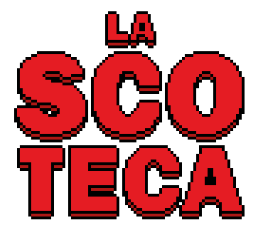

## [**PLAY GAME**](https://kutt.it/lascoteca)

# 

Gioco in stile Pixel Art, simpaticamente ispirato a un meme del WEB.

## Come si gioca

Bisogna ascoltare la voce della signora e, di volta in volta, premere il tasto corrispondente a ciò che sta dicendo (o ha appena detto).

***

&copy; 2020 Giuseppe Rossi

Musica: **Jeremy Blake - Powerup!**

***

## Ambiente di sviluppo

Nella cartella *./src* è contenuto il progetto GDevelop. Va esportato nella cartella *./resources/game*.

